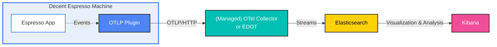

# OpenTelemetry Plugin for Decent Espresso

Plugin for the [Decent Espresso app](https://github.com/decentespresso/de1app). The code is largely inspired by the [Visualizer Upload plugin](https://github.com/decentespresso/de1app/blob/main/de1plus/plugins/visualizer_upload/plugin.tcl).


## Overview and Architecture



**Data Flow:**
1. **Coffee Machine**: [Decent Espresso](https://decentespresso.com) with OTLP Plugin (the `plugin.tcl` file) captures shot data, state changes, and water levels.
2. **OpenTelemetry Collector or EDOT**: [Elastic Distribution for OpenTelemetry](https://www.elastic.co/docs/reference/edot-collector/) is an open source distribution of the OpenTelemetry Collector that receives OTLP logs via HTTP.
3. **Elasticsearch**: Stores and indexes all telemetry data with custom attributes using [Streams](https://www.elastic.co/docs/solutions/observability/streams/streams).
4. **Kibana**: Provides dashboards, visualizations, LLM-supported ingestion, and Agents to query the data.


## Installation

Copy the `plugin.tcl` file to your tablet folder `de1plus/plugins/otel`.


## Configuration

* OTLP endpoint: Where an OpenTelemetry Collector or managed endpoint is receiving the data.
* API key: Optional credentials if required by the OTLP endpoint.

To run it in offline mode, start a hotspot on the coffee machine (under *Settings*, like any Android phone), connect a laptop to it, and point the OTLP endpoint to the laptop's IP address.


## Development

* [Environment setup](https://github.com/decentespresso/de1app/blob/main/documentation/de1_app_plugin_development_overview.md#set-up-your-development-environment)
* Symlinked the plugin file into a clone of the de1app repository: `ln -s ~/Documents/GitHub/de1app-otel/plugin.tcl
~/Documents/GitHub/de1app/de1plus/plugins/otel/`
* Start a local OTel Collector with Elastic (version 9.2+): `curl -fsSL https://elastic.co/start-local | sh -s -- --edot`
* Send the following request and find the result in Kibana to make sure it's working end to end:

```sh
curl -XPOST http://localhost:4318/v1/logs -H "Content-Type: application/json" -d '{
    "resourceLogs": [{
        "resource": {
            "attributes": [{
                "key": "service.name",
                "value": { "stringValue": "my-service" }
            }]
        },
        "scopeLogs": [{
            "scope": {
                "name": "my-logger"
            },
            "logRecords": [{
                "timeUnixNano": "'$(date +%s%N)'",
                "observedTimeUnixNano": "'$(date +%s%N)'",
                "severityText": "INFO",
                "severityNumber": 9,
                "body": {
                    "stringValue": "Hello, OpenTelemetry!"
                }
            }]
        }]
    }]
}'
```

* Follow the log files in `~/Documents/GitHub/de1app/de1plus/` with `tail -f log.txt | grep -i -E "(ERROR|WARNING|otel)"`. You might have to explicitly flush them with the start / stop button in the app.
* Add an [LLM in Kibana](http://localhost:5601/app/management/insightsAndAlerting/triggersActionsConnectors/connectors) like OpenAI for `chat-completion` (under advanced settings) with model `gpt-4.1-mini` (for `gpt-5-mini` you will need a verified organization). Or use the built-in one on Elastic Cloud.
* Make it the [default AI connector](http://localhost:5601/app/management/ai/genAiSettings).
* [Enable Agent Builder](http://localhost:5601/app/management/ai/agentBuilder).
* Enable wired streams on the [settings page of Streams](http://localhost:5601/app/streams) (at least in 9.2).
* Enable `logs_index` locally by adding `logs_index: logs` in the `elasticsearch/otel:` exporter (right under `password:`). On Elastic Cloud, [turn on wired streams and configure the fleet policy](https://www.elastic.co/docs/solutions/observability/streams/wired-streams#streams-wired-streams-enable).
* Partition in the stream based on `attributes.log.type` for `espresso_state-change`, `espresso_water-level`, `espresso_data-point`, and `espresso_shot`.
* Start with an LLM suggestion for Grok patterns but tweak it if needed. Example patterns (tweaked):
  * `espresso_state-change`: `\[%{TIMESTAMP_ISO8601:attributes.custom.timestamp}\] state_change from:%{WORD:attributes.custom.from_state}, to:%{WORD:attributes.custom.to_state}`
  * `espresso_water-level`: `\[%{TIMESTAMP_ISO8601:attributes.custom.timestamp}\] water_level:%{DATA:attributes.custom.water_level:float}mm, threshold:%{DATA:attributes.custom.water_threshold:float}mm, status:%{LOGLEVEL:severity_text:keyword}`
  * `espresso_data-point`: `\[%{TIMESTAMP_ISO8601:attributes.custom.timestamp}\] elapsed:%{DATA:attributes.custom.elapsed:float}, pressure.pressure:%{DATA:attributes.custom.pressure_pressure:float}, pressure.goal:%{DATA:attributes.custom.pressure_goal:float}, flow.flow:%{DATA:attributes.custom.flow_flow:float}, flow.by_weight:%{DATA:attributes.custom.flow_by_weight:float}, flow.by_weight_raw:%{DATA:attributes.custom.flow_by_weight_raw:float}, flow.goal:%{DATA:attributes.custom.flow_goal:float}, temperature.basket:%{DATA:attributes.custom.temperature_basket:float}, temperature.mix:%{DATA:attributes.custom.temperature_mix:float}, temperature.goal:%{DATA:attributes.custom.temperature_goal:float}, totals.weight:%{DATA:attributes.custom.totals_weight:float}, totals.water_dispensed:%{DATA:attributes.custom.totals_water_dispensed:float}, resistance.resistance:%{DATA:attributes.custom.resistance_resistance:float}, resistance.by_weight:%{DATA:attributes.custom.resistance_by_weight:float}, state_change:%{GREEDYDATA:attributes.custom.state_change:float}`
  * `espresso_shot`: `\[%{TIMESTAMP_ISO8601:attributes.custom.timestamp}\] profile:title %{DATA:attributes.custom.profile} author %{DATA:attributes.custom.author} notes \{%{DATA:attributes.custom.notes}\} beverage_type %{WORD:attributes.custom.beverage_type} steps \{.*?\} tank_temperature %{DATA:attributes.custom.tank_temperature:float} target_weight %{DATA:attributes.custom.target_weight:float} target_volume %{DATA:attributes.custom.target_volume:float} %{GREEDYDATA:attributes.custom.more}` (this is not complete and could be expanded)


* Create a [Data View](http://localhost:5601/app/management/kibana/dataViews) for `logs.*`.
* Build and include a dashboard similar to the included `export.ndjson` example:


* If you're running this on Elastic Cloud and want to provide access to other Elasticians, configure [Oktonaut](https://oktanaut.app.elastic.dev/config)


## Todo

* Further improve the parsing of espresso shots
* Add significant events (and use wired streams for all setups)
* Add Alerts and / or SLOs for the water level
* Integrate scale (and grinder?)
* Document how to run a local LLM for offline mode
* Agent Builder integration for coffee stats
* Integrate Workflows into brewing a coffee? Similar to https://github.com/randomcoffeesnob/decent-advanced-rest-api
