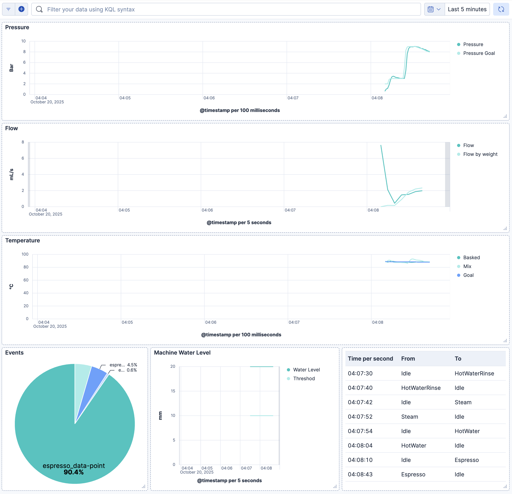

# OpenTelemetry Plugin for Decent Espresso

Plugin for the [Decent Espresso app](https://github.com/decentespresso/de1app). The code is largely inspired by the [Visualizer Upload plugin](https://github.com/decentespresso/de1app/blob/main/de1plus/plugins/visualizer_upload/plugin.tcl).


## Overview and Architecture


**Data Flow:**
1. **Coffee Machine** - Decent Espresso with OTLP Plugin captures shot data, state changes, and water levels
2. **EDOT** - Elastic Distribution for OpenTelemetry receives OTLP logs via HTTP endpoint
3. **Elasticsearch** - Stores and indexes all telemetry data with custom attributes using Streams
4. **Kibana** - Provides dashboards, visualizations, LLM-supported ingestion, and Agents to query the data


## Installation

Copy the `plugin.tcl` file to your tablet folder `de1plus/plugins/otel`.


## Configuration

* OTLP endpoint: Where an OpenTelemetry Collector or managed endpoint is receiving the data.
* Upload minimum seconds: Set to 0 to receive everything or a higher threshold to skip quick rinses or quickly cancelled operations.

To run it in offline mode, start a hotspot on the coffee machine (under settings, like any Android phone), connect a laptop to it, and point the OTLP endpoint to the laptop's IP address.


## Development

* [Environment setup](https://github.com/decentespresso/de1app/blob/main/documentation/de1_app_plugin_development_overview.md#set-up-your-development-environment)
* Symlinked the plugin file into a clone of the de1app repository: `ln -s ~/Documents/GitHub/de1app-otel/plugin.tcl
~/Documents/GitHub/de1app/de1plus/plugins/otel/`
* Start a local OTel Collector with Elastic: `curl -fsSL https://elastic.co/start-local | sh -s -- --edot`
  This needs to be at least version 9.2 and you can use snapshots: `curl -fsSL https://elastic.co/start-local | sh -s -- --edot -v 9.2.0-SNAPSHOT`
* Send the following request and find the result in Kibana to make sure it's working end to end:

```sh
curl -XPOST http://localhost:4318/v1/logs -H "Content-Type: application/json" -d '{
    "resourceLogs": [{
        "resource": {
            "attributes": [{
                "key": "service.name",
                "value": { "stringValue": "my-service" }
            }]
        },
        "scopeLogs": [{
            "scope": {
                "name": "my-logger"
            },
            "logRecords": [{
                "timeUnixNano": "'$(date +%s%N)'",
                "observedTimeUnixNano": "'$(date +%s%N)'",
                "severityText": "INFO",
                "severityNumber": 9,
                "body": {
                    "stringValue": "Hello, OpenTelemetry!"
                }
            }]
        }]
    }]
}'
```

* Follow the log files in `~/Documents/GitHub/de1app/de1plus/` with `tail -f log.txt | grep -i -E "(ERROR|WARNING|otel)"`. You might have to explicitly flush them with the start / stop button in the app.
* Add an [LLM in Kibana](http://localhost:5601/app/management/insightsAndAlerting/triggersActionsConnectors/connectors) like OpenAI for `chat-completion` with model `gpt-4.1-mini` (for `gpt-5-mini` you will need a verified organization). And make it the [default AI connector](http://localhost:5601/app/management/ai/genAiSettings).
* [Enable Agent Builder](http://localhost:5601/app/management/ai/agentBuilder).
* For parsing, use Streams. Match on the `log.type`:
  * for `espresso_state-change` a pattern like `\[%{TIMESTAMP_ISO8601:attributes.custom.coffee_machine_timestamp:string}\] state_change from:%{DATA:attribute.custom.state_from:keyword}, to:%{GREEDYDATA:attributes.custom.state_to:keyword}` and a date pattern for `attributes.custom.coffee_machine_timestamp`
  * for `espresso_water-level` a pattern like `\[%{TIMESTAMP_ISO8601:attributes.custom.coffee_machine_timestamp:string}\] water_level:%{DATA:attributes.custom.water_level:float}mm, threshold:%{DATA:attributes.custom.threshod:float}mm, status:%{GREEDYDATA:attributes.custom.status:keyword}` and a date pattern for `attributes.custom.coffee_machine_timestamp`
  * for `espresso_data-point` a pattern like `\[%{TIMESTAMP_ISO8601:attributes.custom.coffee_machine_timestamp:string}\] elapsed:%{DATA:attribute.custom.elapsed:float},%{SPACE}%{DATA}:%{DATA:attributes.custom.pressure:float},%{SPACE}%{DATA}:%{DATA:attributes.custom.pressure_goal:float},%{SPACE}%{DATA}:%{DATA:attributes.custom.flow:float},%{SPACE}%{DATA}:%{DATA:attributes.custom.flow_by_weight:float},%{SPACE}%{DATA}:%{DATA:attributes.custom.flow_by_weight_raw:float},%{SPACE}%{DATA}:%{DATA:attributes.custom.flow_goal:float},%{SPACE}%{DATA}:%{DATA:attributes.custom.temperature_basked:float},%{SPACE}%{DATA}:%{DATA:attributes.custom.temperature_mix:float},%{SPACE}%{DATA}:%{DATA:attributes.custom.temperature_goal:float},%{SPACE}%{DATA}:%{DATA:attributes.custom.totals_weight:float},%{SPACE}%{DATA}:%{DATA:attributes.custom.water_dispensed:float},%{SPACE}%{DATA}:%{DATA:attributes.custom.resistance:keyword},%{SPACE}%{DATA}:%{DATA:attributes.custom.resistance_by_weight:float},%{SPACE}%{DATA}:%{GREEDYDATA:attributes.custom.state_change:float}` and a date pattern for `attributes.custom.coffee_machine_timestamp`
  * for `espresso_shot` a pattern like `\[%{TIMESTAMP_ISO8601:attributes.custom.coffee_machine_timestamp:string}\] profile:title \{%{DATA:attributes.custom.coffee_profile:keyword}\}\s%{GREEDYDATA:body.text:text}` and a date pattern for `attributes.custom.coffee_machine_timestamp`


* Build and include a dashboard similar to the included `export.ndjson` example:


